### 管理员后台文档

#### 用户相关

##### 都是普通用户，可以添加，删除，更新

1，用户列表，显示用户信息，可以更新或者删除用户
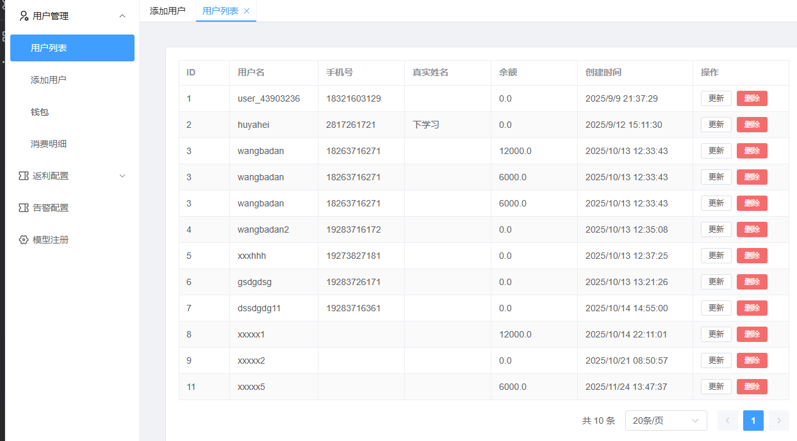
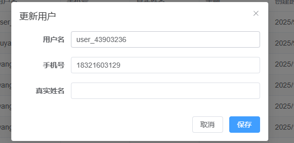

2, 添加用户
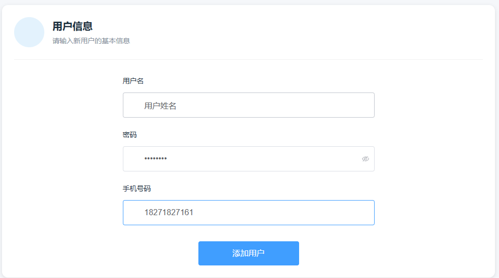

3，钱包，给用户充值
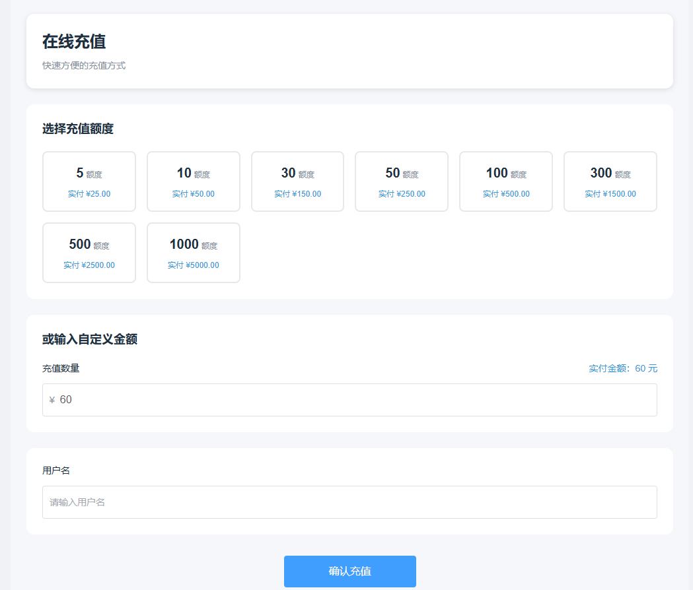

4，消费明细，根据用户列表中的ID，显示用户消费明细
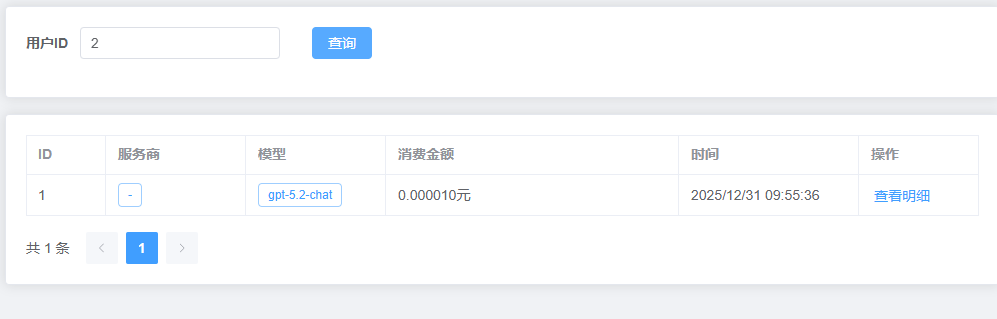

#### 返利配置

#####

1,新增返利配置，返利是根据用户设置的，需要填写用户ID. 创建时候默认都是开启的.需要配置起始金额，结束金额和返点比例
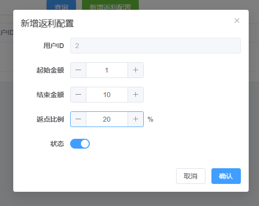

2,根据id查询对应用户返利配置,同时可以编辑
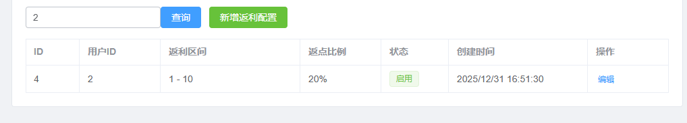

3，根据用户ID显示返利明细
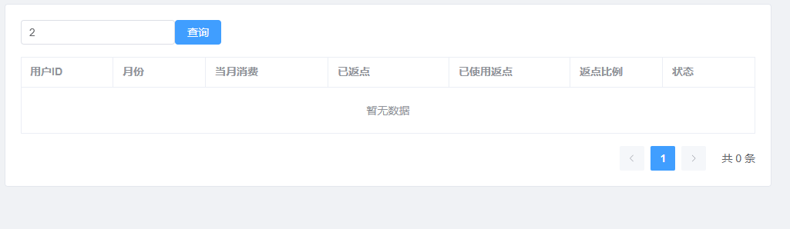

#### 告警配置

##### 告警分为 token和billing告警

1，告警列表
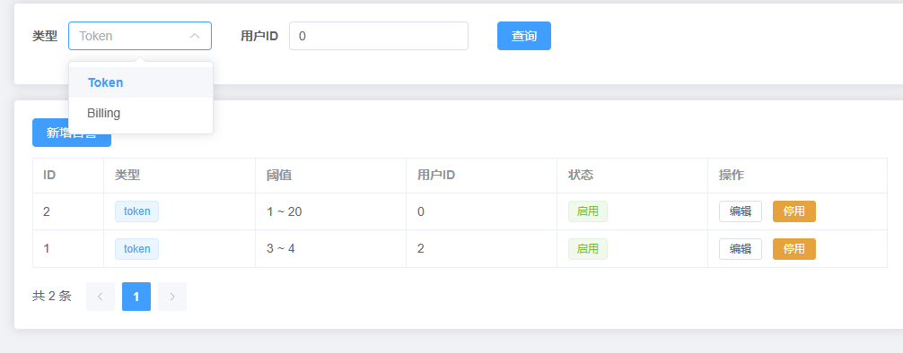

2，新增告警，如果用户ID是0，则是全局的配置，对所有用户生效
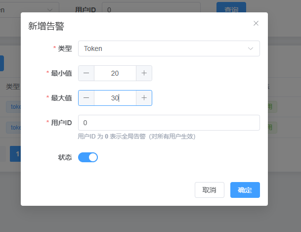

### 用户明细文档

##### 用户明需，查询用户每次调用的消费信息，分为文字，图片和视频

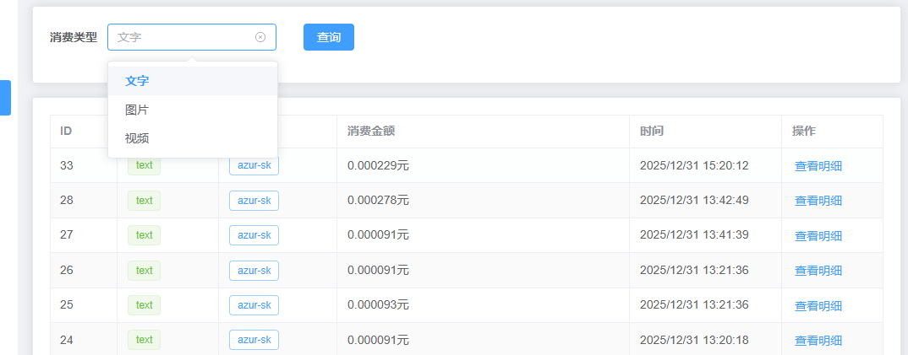
