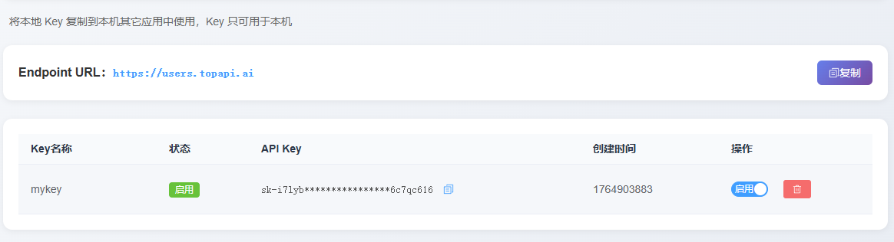

1，用户后台 useradmin.topapi.ai
2，节点后台 nodeadmin.topapi.ai
3，管理员后台 platformadmin.topapi.ai

用户账号需要管理员登录后，添加用户，目前添加了一个测试号，
账号：test101 密码：qq123456
目前节点后台已经都配置好了，后面新加模型和节点，可以节点后台添加

文档

```
https://docs.burncloud.com/books/api/page/google-gemini-generate-content#bkmrk-%F0%9F%92%A1-%E8%AF%B7%E6%B1%82%E7%A4%BA%E4%BE%8B

```

### 用户使用

##### 后台管理

1,使用管理员添加的账号，登录后台
2,令牌管理里面，添加一个key,并且启用

3,模型市场去订阅对应的模型


##### 接口调用

```
所有调用,header里面加上下面的认证key
{
    "Authorization":"上面管理后台复制的key"
}
```

###### 1.获取订阅模型

```
后台订阅模型后,这里需要获取一次
https://users.topapi.ai/v1/getModelList
POST

```

###### 2.获取模型列表

```
https://users.topapi.ai/v1/models
GET
```

###### 3.聊天

```
https://users.topapi.ai/v1/chat/completions
POST
 "stream":false,  批量非流式
 "stream":true,  流式写法
{
  "model": "gpt-4.1-mini",
  "stream":false,
  "messages": [
    {
      "role": "system",
      "content": "你现在是一名策略产品经理，你擅长进行市场研究和竞品分析，以制定产品策略。"
    },
    {
      "role": "user",
      "content": "帮我计算1+5等于多少"
    }
  ],
  "temperature": 1,
  "top_p": 1
}

```

###### 4.Response模型列表

```
https://users.topapi.ai/responses/v1/models
GET
```

###### 5.Responses API

```
https://users.topapi.ai/responses/v1/responses
POST

{
  "model": "gpt-4.1-mini",
  "stream":false,
  "input": [
    {
      "role": "system",
      "content": "你现在是一名策略产品经理，你擅长进行市场研究和竞品分析，以制定产品策略。"
    },
    {
      "role": "user",
      "content": "帮我计算1+5等于多少"
    }
  ],
  "temperature": 1,
  "top_p": 1
}
```

###### 6.gemini模型列表

```
https://users.topapi.ai/gemini/v1beta/models
GET
```

###### 7.gemini模型调用

```
https://users.topapi.ai/gemini/v1beta/models/gemini-2.5-flash:streamGenerateContent
POST

{
    "stream":false,
    "alt":"sse",
    "generationConfig": {
        "maxOutputTokens": 1024,
        "temperature": 0.7
    },
    "contents": [{
        "role": "user",
        "parts":[{"text": "Write a story about a magic backpack."}]
    }]
}
```

###### 8.图像生成

```
https://users.topapi.ai/v1/images/generations
POST

{
  "model": "gpt-image-1",
  "prompt": "一只黄色的猫咪",
  "n": 1,
  "size": "1024x1024",
  "quality": "low",
  "stream": false
}
```

###### 9.图像编辑

```
https://users.topapi.ai//v1/images/edits
POST

{
	"model": "gpt-image-1",
	"image": "iVBORw0KGgoAAAANSUhEUgAAAGQAAABkCAIAAAD/gAIDAAABCElEQVR4nO3cQQnDQBBA0W6phdiKnypYPxVSIzURByH/sITCewKG5TPHYcf8/h5c87z7Af9ErECsQKxArECsQKxArECsQKxArECsQKxArECsQKxArECsQKxArECsQKxArECsQKxArECsQKxArOC1bvT7s60bfm7uS06DbFYgViBWIFYgViBWIFYgViBWIFYgViBWIFYgViBWIFYgViBWIFYgViBWIFYgViBWIFYgViBWIFYgViBWIFYgViBWIFYgViBWIFYgViBWIFYwfL15nc0KxArECsQKxArECsQKxArECsQKxArECsQKxArECsQKxArECsQKxArECsQKxArECsQKxArECsQKDkU2CElYzAluAAAAAElFTkSuQmCC",
	"prompt": "把图片中的猫变成一只狮子",
	"n": 1,
	"size": "1024x1024",
	"stream": false
}
```

###### 10.视频生成

```
https://users.topapi.ai/v1/videos
POST  异步,使用返回的id,去下载视频

{
  "model": "sora-2",
  "prompt": "一只猫咪在打球",
  "duration": 5,
  "resolution": "480p",
  "fps": 30
}
```

###### 11.获取视频任务信息

```
https://users.topapi.ai/v1/videos/video_6936d4257f448190b25f416589f80f38
GET


```

###### 12.下载视频

```
https://users.topapi.ai/v1/videos/video_69329731702481909eea785f9cf4a858/content
POST

```

###### 12.编辑视频

```
https://users.topapi.ai/v1/videos/video_695225f1737481908092ce451591a639030798c1ce683644/remix
POST
{
    "prompt":"猫咪改成老虎"
}
```

##### 支持 tool_calls 并可执行回调

```
https://users.topapi.ai/responses/v1/responses
POST

{
  "model": "gpt-4.1-mini",
  "stream":false,
  "input": [
    {
      "role": "system",
      "content": "你现在是一名策略产品经理，你擅长进行市场研究和竞品分析，以制定产品策略。"
    },
    {
      "role": "user",
      "content": "帮我计算1+5等于多少"
    }
  ],
  "temperature": 1,
  "top_p": 1,
  "tools": [
    {
        "name":"calc",
      "type": "function",
      "function": {
        "name": "calc",
        "description": "计算数学表达式",
        "parameters": {
          "type": "object",
          "properties": {
            "expr": { "type": "string" }
          },
          "required": ["expr"]
        }
      }
    }
  ]
}
```

##### 自动识别图片 / 音频 / 文本输入类型 这里传入了图片和文字描述，图片链接可以任意访问到的链接，

```
https://users.topapi.ai/responses/v1/responses
POST
{
  "model": "gpt-4.1-mini",
  "stream":false,
  "input": [
  {
    "role": "user",
    "content": [
      { "type": "input_text", "text": "这张图里有什么？" },
      {
        "type": "input_image",
        "image_url": "https://picsum.photos/200/200"
      }
    ]
   }
  ],
  "temperature": 1,
  "top_p": 1
}
```
