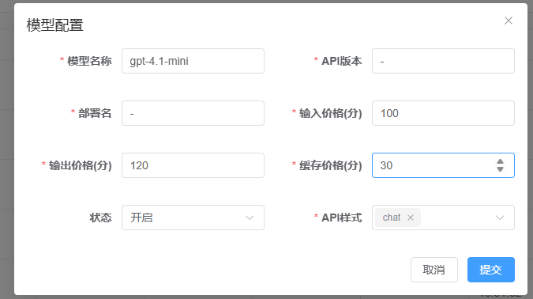
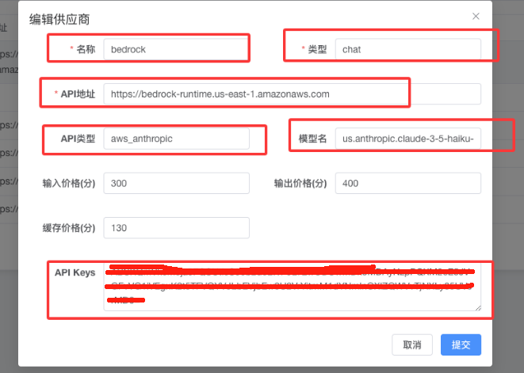
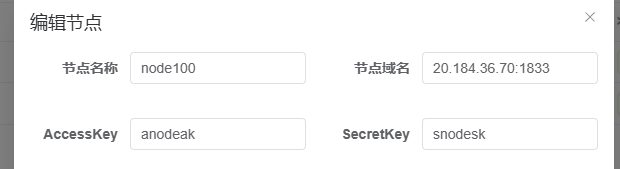
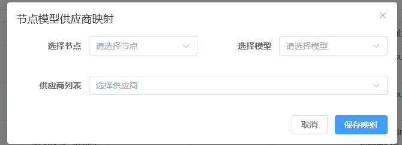

### 一,管理员

platformadmin.topapi.ai

##### 后台添加模型

```
前面有红心的必填,API版本目前用-表示,地址可以不填
模型名称: 显示给用户看的模型名称
如果是azure的,API版本和部署名称必填,参考llm_agent.json
```



<span style="color:red">json配置数据提供参考,域名和key可能已经失效</span>

### 二,节点用户

```
添加供应商  参考提供的 llm_agent.json文件中的providers里面的内容
名称: 供应商名称
类型: 模型类型
API地址: 模型地址
API类型: 模型类型
模型名: 可不填,填写需要填上游真实名字
价格: 供应商的价格,是成本价
API keys: 上游供应商的key
```



```
一个用户只配置一个节点,注意节点目前的IP是固定下面的
添加节点
节点名称:任意字符串
节点域名:20.184.36.70:1833
AccessKey:任意字符串
SecretKey:任意字符串
```



```
映射关系
填写完供应商和节点后,需要做映射关系,用户才能看到模型
选择自己填写的供应商和节点,对应上管理员填写的模型
```


